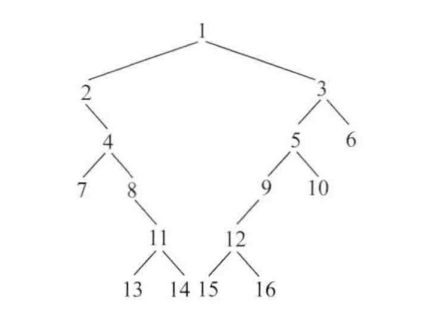

打印二叉树的边界节点
##【题目】
给定一棵二叉树的头节点head,按照如下两种标准分别实现二叉树边界节点的逆时针
打印。
### 标准一：

1. 头节点为边界节点。
2. 叶节点为边界节点。
3. 如果节点在其所在的层中是最左或最右的，那么也是边界节点。

### 标准二：
1. 头节点为边界节点。
2. 叶节点为边界节点。
3. 树左边界延伸下去的路径为边界节点。
4. 树右边界延伸下去的路径为边界节点。

例如，如图3-2所示的树。

图3-2

按标准一的打印结果为：1，2,4，7，11,13，14，15，16,12，10，6,3
按标准二的打印结果为：1,2,4,7，13，14，15，16，10，6,3

###【要求】

1. 如果节点数为A\两种标准实现的时间复杂度要求都为O(A/),额外空间复杂度要
求都为O(A),A为二叉树的高度。
2. 两种标准都要求逆时针顺序且不重复打印所有的边界节点。